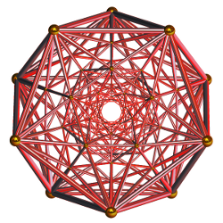

***"Connected Websites"***

The modern web is "missing" a few important pieces which would make it much more useful. Many corporations have stepped in with products to supply these missing pieces, but with a loss of freedom and privacy and increased **centralisation**. 

Centralisation is generally considered a bad thing in network design as the loss of one critical node or centralised service could seriously impact the entire network - possibly taking a long time to recover. Recognising this, the original web was based on decentralised services. Over the years, this fundamental design strength has been largely overlooked, as people congregate into centralised services which provide the missing pieces. 

These missing pieces are (in no particular order):

- Secure and private "spam free" communications

- Identity and "single-signon" across the entire network

- Privacy controls and permissions which extend to the entire network

- Directory services (like a phone book)

The Red Matrix (sometimes referred to as just "Red") is a collection of web servers and services which provides these missing pieces, but within a decentralised identity and messaging framework (known as "Zot"). Red operates as an independent network within the larger internet where all the nodes or servers (we call them "hubs") are able to fully interact with each other in ways that are simply not possible using other services. Additionally the owners of each network hub have the ability to set their own rules with regard to communications privacy and data ownership, because each operates with complete independence. These hubs require only slightly more resources than a blog or content management system, and the software is being designed with the ability to natively incorporate both kinds of functionality, as well as cloud storage. 

Whilst other decentralised communications networks exist, an additional weakness we've found in the implementation of these systems is the binding of network identity with the physical server where it resides; for example if you are "eric@example.website", your identity is often tied permanently to "example.website". We see this as a problem. Many hubs on the Indie Web are run by enthusiasts with varying skill levels and financial resources - and the technology is changing quite rapidly. Often the cost or workload involved in maintaining these services becomes a burden (or hardware fails) and people or entire social communities are left stranded when their server goes offline. Their identity no longer exists. They may have to "start over" building their social circle from scratch when this happens. In some cases communities are unable to recover from this kind of disruption and the entire community dissolves. 

We've been working on decentralisation for several years and have seen this happen time and time again. 
Within the Red Matrix, identity is nomadic. It defines you and it belongs to you - and is not locked to a particular network address. You can take your identity, and all your friends and associates with you - to any other hub in the network, at any time. If your hub goes offline for any reason, you have the ability to relocate to any other hub and carry on as if nothing happened. You still have all your friends and associations.

 
The Red Matrix is free and open source distributed under the MIT license.

Please connect with one of the developer channels ("Channel One" would be a good choice) if you are interested in helping us out. 

[Please help us change the world by providing a small donation.](http://pledgie.com/campaigns/18417) (Large donations are also graciously accepted).

If you would like to become a member of the Red Matrix **right now** , please select a public hub from one of our open providers at [https://zothub.com/pubsites](https://zothub.com/pubsites). All sites are interlinked and you can always move to another, so the choice of site can be somewhat arbitrary.