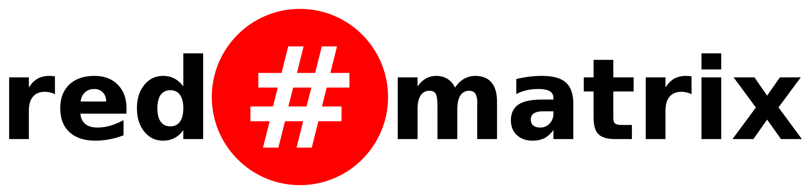

Note: please update your repository pointers to https://github.com/redmatrix/redmatrix .

One of the traditional problems with independent publishing on the internet has always been the fact that independent publishers often operate as isolated islands within their own website, and spend most of their resources attracting visitors. The rise of corporate providers and social networking services alleviated many of these problems; however centralisation has led to a situation where your content is no longer under your direct control. It is shared fully with corporate advertisers and governments, but ironically you are now often asked to pay money to ensure that your friends can see it. What if you could have advantages of scale and connections that centralisation typically offers whilst maintaining independent control over your own web presence?

The RedMatrix is a super network created from a huge number of smaller independent and autonomous websites - which are linked together into a cooperative publishing and social platform. It consists of an open source webapp providing a complete multi-user **decentralised** publishing, sharing, and communications system - known as a "hub". Each hub provides communications (private messaging, chat, blogging, forums, and social networking), along with media management (photos, events, files, web pages, shareable apps) for its members; all in a feature-rich platform. These hubs automatically reach out and connect with each other and the rest of the matrix. Privacy and content ownership always remain under the direct personal control of the individual; and permission to access any item can be granted or denied to anybody in the entire matrix.

What makes the RedMatrix unique is what we call "magic authentication" - which is based on our groundbreaking work in decentralised identity services. No other platform provides this ability. Within the matrix the boundaries between different hubs are blurred or seemingly non-existent. Identity in the matrix is considered transient and potentially nomadic. "Who you are" has nothing to do with "what computer you're connected to", and website content can adapt itself according to who is viewing it. You have the ability to "clone" your identity to other hubs; which allows you to continue to communicate with your friends seamlessly if your primary hub is ever disabled (temporarily or permanently).

The RedMatrix is ideal for communities of any size, from private individuals and families to online forums, business websites, and organisations. It can be used by anybody who has communications or web content that they wish to share, but where they desire complete control of whom they share it with.

The Red Matrix is free and open source distributed under the MIT license.

For a list of public hubs see [redmatrix.me/pubsites](https://redmatrix.me/pubsites). For installation instructions see [install/INSTALL.txt](install/INSTALL.txt)
